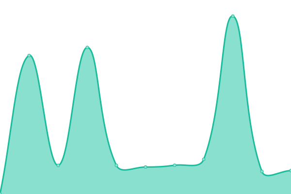
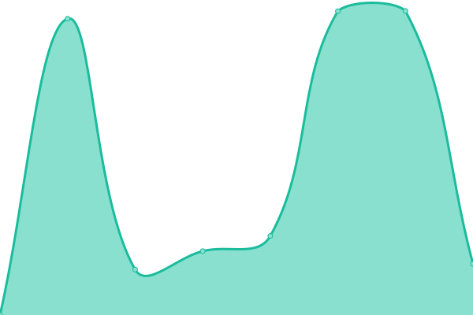
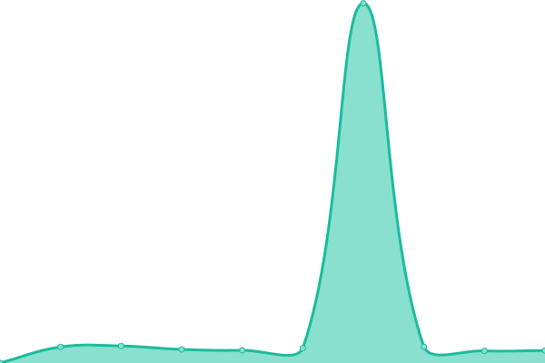
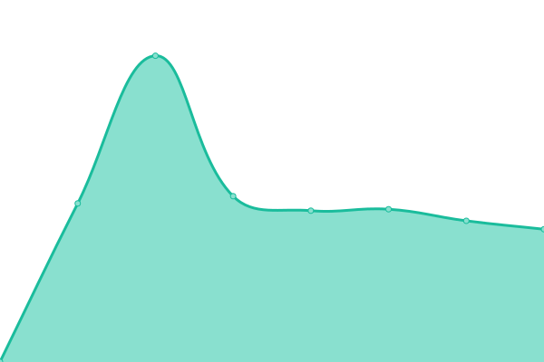
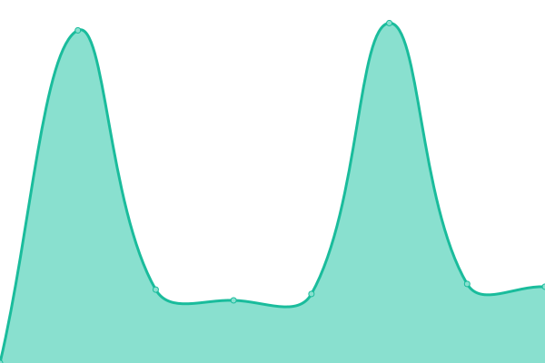

# [📈 Live Status](https://status.aimodotes.org): <!--live status--> **🟩 All systems operational**

This repository contains the open-source uptime monitor and status page for [e-Αιμοδότες](https://e-aimodotes.gr/), powered by [Upptime](https://github.com/upptime/upptime).

With [Upptime](https://upptime.js.org), you can get your own unlimited and free uptime monitor and status page, powered entirely by a GitHub repository. We use [Issues](https://github.com/eAimodotes/aimodotes-status/issues) as incident reports, [Actions](https://github.com/eAimodotes/aimodotes-status/actions) as uptime monitors, and [Pages](https://status.aimodotes.org) for the status page.

<!--start: status pages-->
<!-- This summary is generated by Upptime (https://github.com/upptime/upptime) -->
<!-- Do not edit this manually, your changes will be overwritten -->
<!-- prettier-ignore -->
| URL | Status | History | Response Time | Uptime |
| --- | ------ | ------- | ------------- | ------ |
|  [e-Αιμοδότες](https://e-aimodotes.gr/) | 🟩 Up | [e-aimodotes.yml](https://github.com/eAimodotes/aimodotes-status/commits/HEAD/history/e-aimodotes.yml) | 

 1101ms
     
 | 

<a href="https://status.aimodotes.org/history/e-aimodotes">100.00%</a>
    

|  e-Αιμοδότες για νοσοκομεία | 🟩 Up | [e-aimodotes-gia-nosokomeia.yml](https://github.com/eAimodotes/aimodotes-status/commits/HEAD/history/e-aimodotes-gia-nosokomeia.yml) | 

 972ms
     
 | 

<a href="https://status.aimodotes.org/history/e-aimodotes-gia-nosokomeia">100.00%</a>
    

|  [e-Αιμοδότες API (Mobile Apps)](https://api.e-aimodotes.gr/metrics/uptime/) | 🟩 Up | [e-aimodotes-api-mobile-apps.yml](https://github.com/eAimodotes/aimodotes-status/commits/HEAD/history/e-aimodotes-api-mobile-apps.yml) | 

 892ms
     
 | 

<a href="https://status.aimodotes.org/history/e-aimodotes-api-mobile-apps">100.00%</a>
    

|  [e-Αιμοδότες (Κράτηση Ραντεβού για Αιμοδοσία)](https://bookings.e-aimodotes.gr/) | 🟩 Up | [e-aimodotes-kratisi-rantevoy-gia-aimodosia.yml](https://github.com/eAimodotes/aimodotes-status/commits/HEAD/history/e-aimodotes-kratisi-rantevoy-gia-aimodosia.yml) | 

 1248ms
     
 | 

<a href="https://status.aimodotes.org/history/e-aimodotes-kratisi-rantevoy-gia-aimodosia">100.00%</a>
    

|  [e-Αιμοδότες ΑμΚΕ](https://aimodotes.org/) | 🟩 Up | [e-aimodotes-am-ke.yml](https://github.com/eAimodotes/aimodotes-status/commits/HEAD/history/e-aimodotes-am-ke.yml) | 

 1449ms
     
 | 

<a href="https://status.aimodotes.org/history/e-aimodotes-am-ke">100.00%</a>
    

|  Μητρώο εθελοντών (ΑμΚΕ) | 🟩 Up | [mitroo-ethelonton-am-ke.yml](https://github.com/eAimodotes/aimodotes-status/commits/HEAD/history/mitroo-ethelonton-am-ke.yml) | 

 648ms
     
 | 

<a href="https://status.aimodotes.org/history/mitroo-ethelonton-am-ke">100.00%</a>
    

|  Στατιστικά εφαρμογών | 🟩 Up | [statistika-efarmogon.yml](https://github.com/eAimodotes/aimodotes-status/commits/HEAD/history/statistika-efarmogon.yml) | 

 847ms
     
 | 

<a href="https://status.aimodotes.org/history/statistika-efarmogon">100.00%</a>
    

|  Διακομιστής Ίρις (Δημοκρίτειο Πανεπιστήμιο Θράκης) | 🟩 Up | [diakomistis-iris-dimokriteio-panepistimio-t-hrakis.yml](https://github.com/eAimodotes/aimodotes-status/commits/HEAD/history/diakomistis-iris-dimokriteio-panepistimio-t-hrakis.yml) | 

 1078ms
     
 | 

<a href="https://status.aimodotes.org/history/diakomistis-iris-dimokriteio-panepistimio-t-hrakis">100.00%</a>
    

|  Διακομιστής Ερμής (Εθνικό Δίκτυο Υποδομών Τεχνολογίας και Έρευνας) | 🟩 Up | [diakomistis-ermis-ethniko-diktyo-ypodomon-texnologias-kai-ereynas.yml](https://github.com/eAimodotes/aimodotes-status/commits/HEAD/history/diakomistis-ermis-ethniko-diktyo-ypodomon-texnologias-kai-ereynas.yml) | 

 970ms
     
 | 

<a href="https://status.aimodotes.org/history/diakomistis-ermis-ethniko-diktyo-ypodomon-texnologias-kai-ereynas">100.00%</a>
    

|  Διακομιστής Αρετή (Cloudflare) | 🟩 Up | [diakomistis-areti-cloudflare.yml](https://github.com/eAimodotes/aimodotes-status/commits/HEAD/history/diakomistis-areti-cloudflare.yml) | 

 705ms
     
 | 

<a href="https://status.aimodotes.org/history/diakomistis-areti-cloudflare">100.00%</a>
    

<!--end: status pages-->

[**Visit our status website →**](https://status.aimodotes.org)

## 📄 License

- Powered by: [Upptime](https://github.com/upptime/upptime)
- Code: [MIT](./LICENSE) © [e-Αιμοδότες](https://e-aimodotes.gr/)
- Data in the `./history` directory: [Open Database License](https://opendatacommons.org/licenses/odbl/1-0/)
