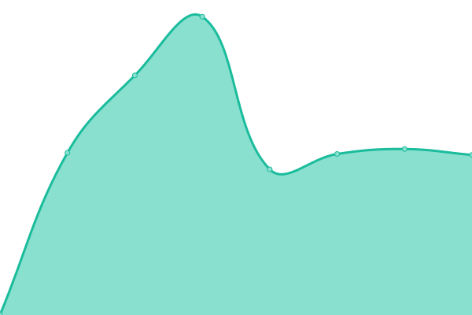

# [📈 Live Status](https://status.aimodotes.org): <!--live status--> **🟩 All systems operational**

This repository contains the open-source uptime monitor and status page for [e-Αιμοδότες](https://e-aimodotes.gr/), powered by [Upptime](https://github.com/upptime/upptime).

With [Upptime](https://upptime.js.org), you can get your own unlimited and free uptime monitor and status page, powered entirely by a GitHub repository. We use [Issues](https://github.com/eAimodotes/aimodotes-status/issues) as incident reports, [Actions](https://github.com/eAimodotes/aimodotes-status/actions) as uptime monitors, and [Pages](https://status.aimodotes.org) for the status page.

<!--start: status pages-->
<!-- This summary is generated by Upptime (https://github.com/upptime/upptime) -->
<!-- Do not edit this manually, your changes will be overwritten -->
<!-- prettier-ignore -->
| URL | Status | History | Response Time | Uptime |
| --- | ------ | ------- | ------------- | ------ |
|  [e-Αιμοδότες](https://e-aimodotes.gr/) | 🟩 Up | [e-aimodotes.yml](https://github.com/eAimodotes/aimodotes-status/commits/HEAD/history/e-aimodotes.yml) | 

 4959ms
     
 | 

<a href="https://status.aimodotes.org/history/e-aimodotes">100.00%</a>
    

|  [e-Αιμοδότες για νοσοκομεία](https://myhospital.e-aimodotes.gr/) | 🟩 Up | [e-aimodotes-gia-nosokomeia.yml](https://github.com/eAimodotes/aimodotes-status/commits/HEAD/history/e-aimodotes-gia-nosokomeia.yml) | 

 1069ms
     
 | 

<a href="https://status.aimodotes.org/history/e-aimodotes-gia-nosokomeia">100.00%</a>
    

|  [e-Αιμοδότες API](https://api.e-aimodotes.gr/metrics/uptime/) | 🟩 Up | [e-aimodotes-api.yml](https://github.com/eAimodotes/aimodotes-status/commits/HEAD/history/e-aimodotes-api.yml) | 

 817ms
     
 | 

<a href="https://status.aimodotes.org/history/e-aimodotes-api">100.00%</a>
    

|  [e-Αιμοδότες Αστική Μη Κερδοσκοπική Εταιρεία](https://aimodotes.org/) | 🟩 Up | [e-aimodotes-astiki-mi-kerdoskopiki-etaireia.yml](https://github.com/eAimodotes/aimodotes-status/commits/HEAD/history/e-aimodotes-astiki-mi-kerdoskopiki-etaireia.yml) | 

 1037ms
     
 | 

<a href="https://status.aimodotes.org/history/e-aimodotes-astiki-mi-kerdoskopiki-etaireia">100.00%</a>
    

|  [Μητρώο εθελοντών](https://ethelontes.aimodotes.org/) | 🟩 Up | [mitroo-ethelonton.yml](https://github.com/eAimodotes/aimodotes-status/commits/HEAD/history/mitroo-ethelonton.yml) | 

 657ms
     
 | 

<a href="https://status.aimodotes.org/history/mitroo-ethelonton">100.00%</a>
    

<!--end: status pages-->

[**Visit our status website →**](https://status.aimodotes.org)

## 📄 License

- Powered by: [Upptime](https://github.com/upptime/upptime)
- Code: [MIT](./LICENSE) © [e-Αιμοδότες](https://e-aimodotes.gr/)
- Data in the `./history` directory: [Open Database License](https://opendatacommons.org/licenses/odbl/1-0/)
